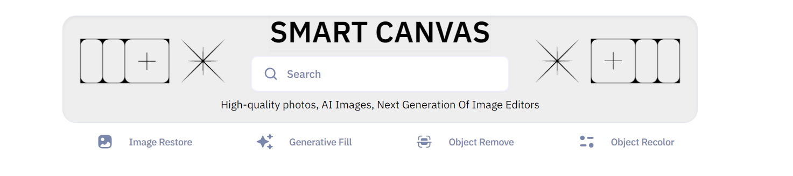
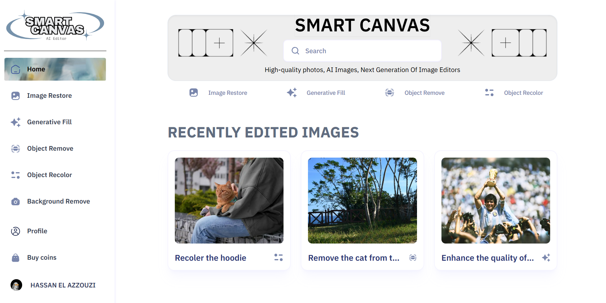
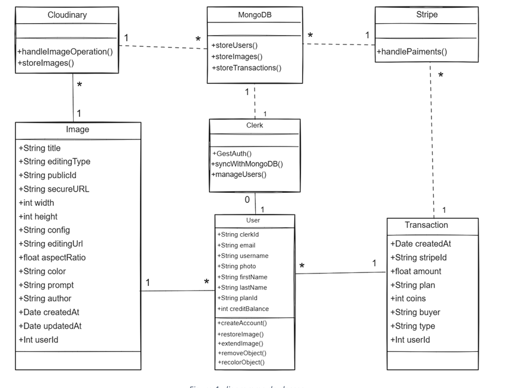
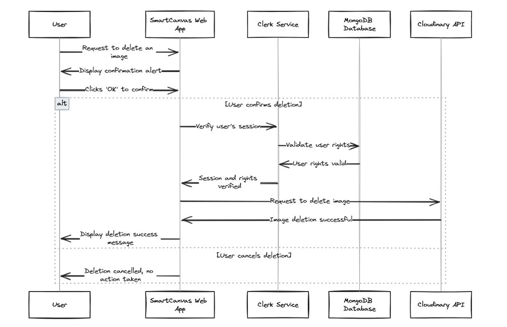

# SmartCanvas AI Editor - README

## Introduction

Welcome to SmartCanvas, an AI-powered image manipulation SaaS platform designed to provide users with advanced tools for editing and enhancing their images. This repository contains the source code for the SmartCanvas project, which leverages machine learning models and cloud-based APIs to deliver a seamless and powerful image editing experience.



## Table of Contents

- [Introduction](#introduction)
- [Features](#features)
- [Technologies Used](#technologies-used)
- [Architecture](#architecture)
- [Installation](#installation)
- [Usage](#usage)
- [Contributing](#contributing)
- [License](#license)
- [Acknowledgements](#acknowledgements)

## Features

- **User Authentication**: Secure sign-up, login, and logout functionalities.
- **Image Upload and Management**: Users can upload images, manage their accounts, and view their image gallery.
- **Advanced Image Editing Tools**:
  - Object Removal
  - Background Removal
  - Image Restoration
  - Generative Fill
  - Object Recoloring
  - Image Extension
- **Integration with Cloudinary API**: For processing images using various AI models.
- **User Profile and Image Gallery**: Users can view their profile and access recently edited images.

## Technologies Used

- **Frontend**: Next.js (HTML5, Tailwind CSS, TypeScript), Shadcn/ui
- **Backend**: Bun
- **Database**: MongoDB
- **Cloud Services**: Cloudinary for image processing
- **Authentication**: Clerk
- **Other Libraries**: Various Bun/ Bun x packages for frontend and backend development

## Architecture

The architecture of SmartCanvas is designed to be scalable and maintainable. It consists of the following components:

- **SmartCanvas**: The main application handling user interactions and coordinating between other components.
- **Clerk**: Manages user authentication and database interactions.
- **MongoDB**: Stores user data and image metadata.
- **Cloudinary API**: Provides advanced image processing capabilities.
  
### Class Diagram

The class diagram illustrates the relationships between the main components:



### Sequence Diagram

The sequence diagram details the interactions during key user operations:



## Installation

To set up the project locally, follow these steps:

1. **Clone the Repository**:
    ```bash
    git clone git@github.com:ElazzouziHassan/ImageEditor.git
    cd ImageEditor
    ```

2. **Install Dependencies**:
    ```bash
    bun install
    ```
-**Note!**: Some Dependencies you will need to add them by runnig `bun x add <package name>`

3. **Set Up Environment Variables**:
    Create a `.env` file in the root directory and add the following environment variables:
    ```
    # Clerk & Clerk URLs :
    NEXT_PUBLIC_CLERK_PUBLISHABLE_KEY=<Your public clerk key>
    CLERK_SECRET_KEY=<Your secret clerk key>

    NEXT_PUBLIC_CLERK_SIGN_IN_URL=/sign-in
    NEXT_PUBLIC_CLERK_SIGN_UP_URL=/sign-up

    NEXT_PUBLIC_CLERK_AFTER_SIGN_IN_URL=/
    NEXT_PUBLIC_CLERK_AFTER_SIGN_UP_URL=/

    # MongoDB :
    MONGODB_URL=<Your mongoDB URL>

    # CLERK WEBHOOK SECRET KEY :
    WEBHOOK_SECRET=<Your Clerk webhook secret key>

    #CLOUDINARY
    NEXT_PUBLIC_CLOUDINARY_CLOUD_NAME=<Your cloudinary username>
    CLOUDINARY_API_KEY=<Your API key>
    CLOUDINARY_API_SECRET=<Your API secret key>

    # STRIPE
    NEXT_PUBLIC_STRIPE_PUBLISHABLE_KEY=<Your stripe public key>
    STRIPE_SECRET_KEY=<Your stripe secret key>
    STRIPE_WEBHOOK_SECRET=<Your stripe webhook key>
    ```
4. **Run the Application**:
    ```bash
     bun run dev
    ```

## Usage

Once the application is running, you can access it at `http://localhost:3000`. Create an account, log in, and start uploading and editing images using the available tools.

## Contributing

We welcome contributions to improve SmartCanvas! To contribute:

1. Fork the repository.
2. Create a new branch for your feature or bugfix.
    ```bash
    git checkout -b feature-name
    ```
3. Make your changes.
4. Commit your changes.
    ```bash
    git commit -m "Description of your changes"
    ```
5. Push to your branch.
    ```bash
    git push origin feature-name
    ```
6. Open a pull request.

## License

This project is licensed under a custom licence. See the [LICENSE](LICENSE.md) file for details.

## Acknowledgements

- **Cloudinary**: For providing robust image processing services.
- **Clerk**: For seamless user authentication.
- **MongoDB**: For reliable and scalable database services.

---

Thank you for using SmartCanvas! We hope you find it valuable for your image editing needs. If you have any questions or feedback, please feel free to open an issue or contact us.
[Email](mailto:ezhassan.info@gmail.com)
